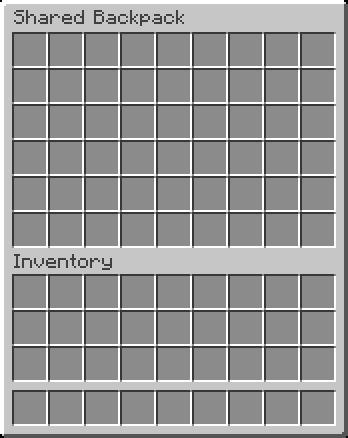

# Shared Backpack
This mod adds a Shared Backpack to the game that can be used by all players.
It is used to share items on friendly multiplayer servers.

The Shared Backpack is the size of a double chest (54 slots) and can be accessed by using the `/backpack` or `/bp` command (no permission required).

 

### Additional Information
This is a server-side mod and does not need to be installed on the client.

The content of the Shared Backpack is stored in the file `/config/shared-backpack/backpack.dat`.
Each time the server is started, this file is backed up to `/config/shared-backpack/backpack.dat_old` before being loaded.